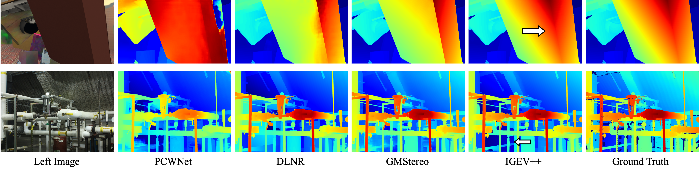
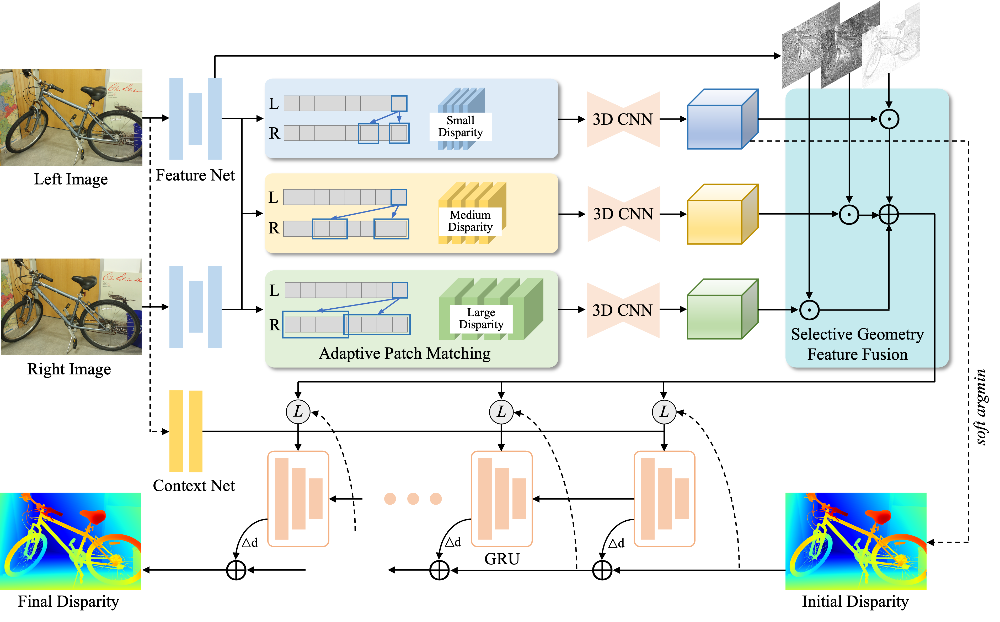
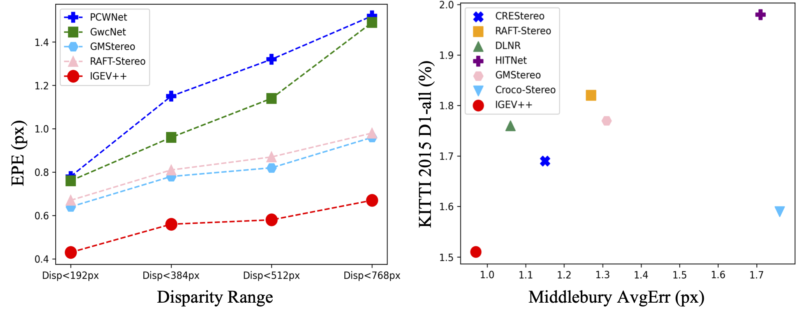

# IGEV++
[IGEV++: Iterative Multi-range Geometry Encoding Volumes for Stereo Matching](https://arxiv.org/pdf/2409.00638) <br/>
Gangwei Xu, Xianqi Wang, Zhaoxing Zhang, Junda Cheng, Chunyuan Liao, Xin Yang <br/>

## Visual comparisons with SOTA methods in large disparities.

PCWNet is a volume filtering-based method, DLNR is an iterative optimization-based method, and GMStereo is a transformer-based method. Our IGEV++ performs well in large textureless regions at close range with large disparities.

## Network architecture

The IGEV++ first builds Multi-range Geometry Encoding Volumes (MGEV) via Adaptive Patch Matching (APM). MEGV encodes coarse-grained geometry information of the scene for textureless regions and large disparities and fine-grained geometry information for details and small disparities after 3D aggregation or regularization. Then we regress an initial disparity map from MGEV through soft argmin, which serves as the starting point for ConvGRUs. In each iteration, we index multi-range and multi-granularity geometry features from MGEV, selectively fuse them, and then input them into ConvGRUs to update the disparity field.

## 📢 News
2024-12-30: We add bfloat16 training to prevent potential NAN issues during the training process.<br>

## Comparisons with SOTA methods

Left: Comparisons with state-of-the-art stereo methods across different disparity ranges on the Scene Flow test set. Our IGEV++ outperforms previously published methods by a large margin across all disparity ranges. 
Right: Comparisons with state-of-the-art stereo methods on Middlebury and KITTI leaderboards.

## Demos
Pretrained models can be downloaded from [google drive](https://drive.google.com/drive/folders/1eubNsu03MlhUfTtrbtN7bfAsl39s2ywJ?usp=drive_link)

We assume the downloaded pretrained weights are located under the pretrained_models directory.

You can demo a trained model on pairs of images. To predict stereo for demo-imgs directory, run
```Shell
python demo_imgs.py --restore_ckpt ./pretrained_models/igev_plusplus/sceneflow.pth --left_imgs './demo-imgs/*/im0.png' --right_imgs './demo-imgs/*/im1.png'
```
You can switch to your own test data directory, or place your own pairs of test images in ./demo-imgs.

## Environment
* NVIDIA RTX 3090
* python 3.8

### Create a virtual environment and activate it.

```Shell
conda create -n IGEV_plusplus python=3.8
conda activate IGEV_plusplus
```
### Dependencies

```Shell
pip install torch==1.12.1+cu113 torchvision==0.13.1+cu113 torchaudio==0.12.1 --extra-index-url https://download.pytorch.org/whl/cu113
pip install tqdm
pip install scipy
pip install opencv-python
pip install scikit-image
pip install tensorboard
pip install matplotlib 
pip install timm==0.5.4

```

## Required Data

* [SceneFlow](https://lmb.informatik.uni-freiburg.de/resources/datasets/SceneFlowDatasets.en.html)
* [KITTI](https://www.cvlibs.net/datasets/kitti/eval_scene_flow.php?benchmark=stereo)
* [ETH3D](https://www.eth3d.net/datasets)
* [Middlebury](https://vision.middlebury.edu/stereo/submit3/)
* [TartanAir](https://github.com/castacks/tartanair_tools)
* [CREStereo Dataset](https://github.com/megvii-research/CREStereo)
* [FallingThings](https://research.nvidia.com/publication/2018-06_falling-things-synthetic-dataset-3d-object-detection-and-pose-estimation)
* [InStereo2K](https://github.com/YuhuaXu/StereoDataset)
* [Sintel Stereo](http://sintel.is.tue.mpg.de/stereo)
* [HR-VS](https://drive.google.com/file/d/1SgEIrH_IQTKJOToUwR1rx4-237sThUqX/view)


## Evaluation

To evaluate IGEV++ on Scene Flow or Middlebury, run

```Shell
python evaluate_stereo.py --restore_ckpt ./pretrained_models/igev_plusplus/sceneflow.pth --dataset sceneflow
```
or
```Shell
python evaluate_stereo.py --restore_ckpt ./pretrained_models/igev_plusplus/sceneflow.pth --dataset middlebury_H
```

To evaluate RT-IGEV++ (real-time version) on Scene Flow, run

```Shell
python evaluate_stereo_rt.py --dataset sceneflow --restore_ckpt ./pretrained_models/igev_rt/sceneflow.pth
```

## Training

To train IGEV++ on Scene Flow or KITTI, run

```Shell
python train_stereo.py --train_datasets sceneflow
```
or
```Shell
python train_stereo.py --train_datasets kitti --restore_ckpt ./pretrained_models/igev_plusplus/sceneflow.pth
```

To train IGEV++ on Middlebury or ETH3D, you need to run
```Shell
python train_stereo.py --train_datasets middlebury_train --restore_ckpt ./pretrained_models/igev_plusplus/sceneflow.pth --image_size 384 512 --num_steps 200000
python train_stereo.py --tarin_datasets middlebury_finetune --restore_ckpt ./checkpoints/middlebury_train.pth --image_size 384 768 --num_steps 100000
```
or
```Shell
python train_stereo.py --train_datasets eth3d_train --restore_ckpt ./pretrained_models/igev_plusplus/sceneflow.pth --image_size 384 512 --num_steps 300000
python train_stereo.py --tarin_datasets eth3d_finetune --restore_ckpt ./checkpoints/eth3d_train.pth --image_size 384 512 --num_steps 100000
```

## Bfloat16 Training
NaN values during training: If you encounter NaN values in your training, this is likely due to overflow when using float16. This can happen when large gradients or high activation values exceed the range represented by float16. To fix this: 

-Try switching to `bfloat16` by using `--precision_dtype bfloat16`.

-Alternatively, you can use `float32` precision by setting `--precision_dtype float32`.

### Training with bfloat16
1. Before you start training, make sure you have hardware that supports bfloat16 and the right environment set up for mixed precision training. Create the environment and install dependencies into it:
    ```Shell
    conda create -n IGEV_plusplus_bf16 python=3.8
    conda activate IGEV_plusplus_bf16
    bash env_bfloat16.sh
    ```

2. Then you can train the model with bfloat16 precision:
   ```Shell
    python train_stereo.py --mixed_precision --precision_dtype bfloat16
    ```

## Submission

For IGEV++ submission to the KITTI benchmark, run
```Shell
python save_disp.py
```

For RT-IGEV++ submission to the KITTI benchmark, run
```Shell
python save_disp_rt.py
```

## Citation

If you find our works useful in your research, please consider citing our papers:

```bibtex

@article{xu2024igev++,
  title={IGEV++: Iterative Multi-range Geometry Encoding Volumes for Stereo Matching},
  author={Xu, Gangwei and Wang, Xianqi and Zhang, Zhaoxing and Cheng, Junda and Liao, Chunyuan and Yang, Xin},
  journal={arXiv preprint arXiv:2409.00638},
  year={2024}
}

@inproceedings{xu2023iterative,
  title={Iterative Geometry Encoding Volume for Stereo Matching},
  author={Xu, Gangwei and Wang, Xianqi and Ding, Xiaohuan and Yang, Xin},
  booktitle={Proceedings of the IEEE/CVF Conference on Computer Vision and Pattern Recognition},
  pages={21919--21928},
  year={2023}
}
```


# Acknowledgements

This project is based on [RAFT-Stereo](https://github.com/princeton-vl/RAFT-Stereo), [GMStereo](https://github.com/autonomousvision/unimatch), and [CoEx](https://github.com/antabangun/coex). We thank the original authors for their excellent works.

